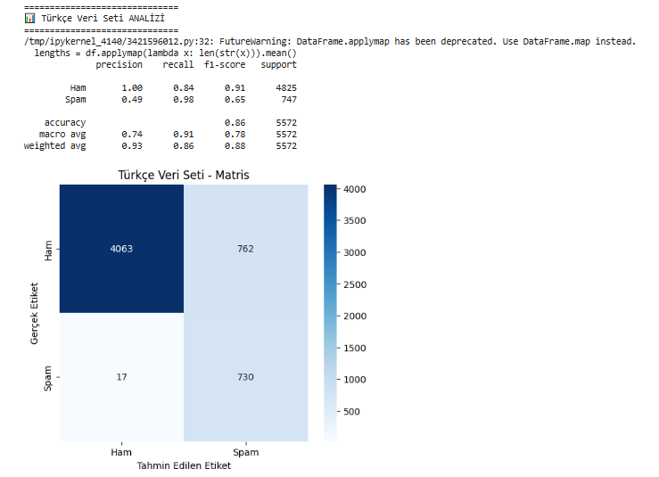
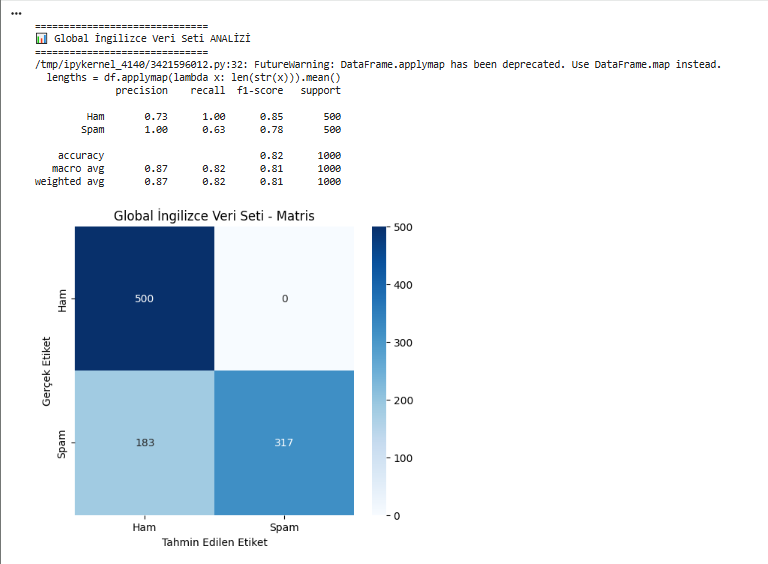

# 🛡️ BERT ile Türkçe ve İngilizce Spam Mesaj Algılama (SMS)

Bu proje, **BERT (Turkish Cased)** mimarisi kullanılarak metin tabanlı mesajların "Güvenli (Ham)" veya "Spam" olarak sınıflandırılması amacıyla geliştirilmiştir.

## 📊 Performans ve Test Sonuçları

Modelin başarısı, karmaşıklık matrisi (confusion matrix) ve sınıflandırma raporları ile doğrulanmıştır. 

### 1. Türkçe Veri Seti Analizi

*   **Doğruluk (Accuracy):** %86
*   **Analiz:** Model, Türkçe karakter yapısına duyarlı olduğu için yerel SMS kalıplarında yüksek başarı sergilemiştir.

### 2. İngilizce (Global) Veri Seti Analizi

*   **Doğruluk (Accuracy):** %82
*   **Analiz:** Modelin farklı dillerdeki genel spam karakteristiğini anlama kapasitesi ölçülmüştür.

---

## 🚀 Kurulum ve Kullanım

### ⚠️ Önemli: Model Ağırlıkları
GitHub dosya boyutu limitleri nedeniyle, modelin ana ağırlık dosyası (`model.safetensors`) bu depoda yer almamaktadır. 

1. Aşağıdaki linkten ana model dosyasını indirin:
    *   🔗 **[Model Ağırlıklarını İndir (https://drive.google.com/file/d/1tVSFfuttv-ChKdvGP_EgqZqODUiZ5yTZ/view?usp=drive_link)]**
2. İndirdiğiniz dosyayı `spam_model_final/` klasörünün içine yerleştirin.
3. ARAYÜZ 

